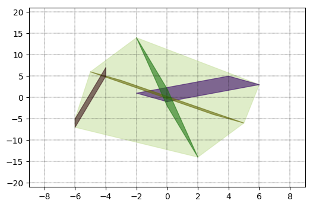

# fourier-motzkin-polyhedra
## Fourier-Motzkin Elimination Method for Polyhedral Projection

This repository consists of python scripts for implementing [Fourier-Motzkin Elimination method](https://en.wikipedia.org/wiki/Fourier%E2%80%93Motzkin_elimination) for removing variables from a set of linear equations. 
Even though there exists similar software (e.g. see [link 1](http://web.cse.ohio-state.edu/~pouchet.2/software/fm/), [link 2](https://github.com/coldfix/cfme), [link 3](https://github.com/stephane-caron/SymPyFME)), I could not find
a reasonably general python script. 

Dependencies:
* [Gurobi](https://gurobi.com). Free license for academic use. I use it for linear programming.
* (Optional) [pycdd](https://pycddlib.readthedocs.io/en/latest/index.html). I use it for visualization 

### Usage: Computing H-representation for convex hull of multiple polytopes
 
More comprehensive documentation coming soon!